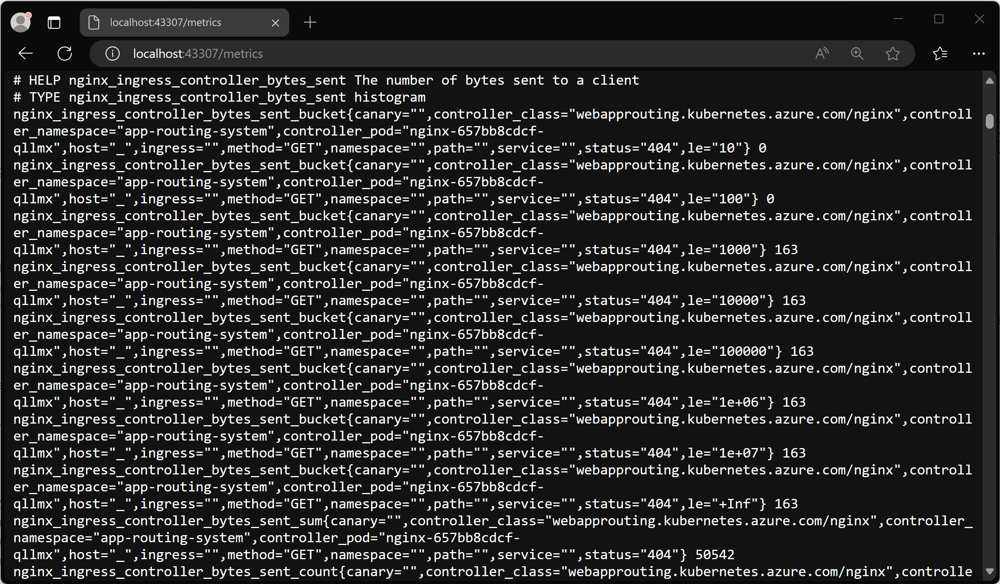
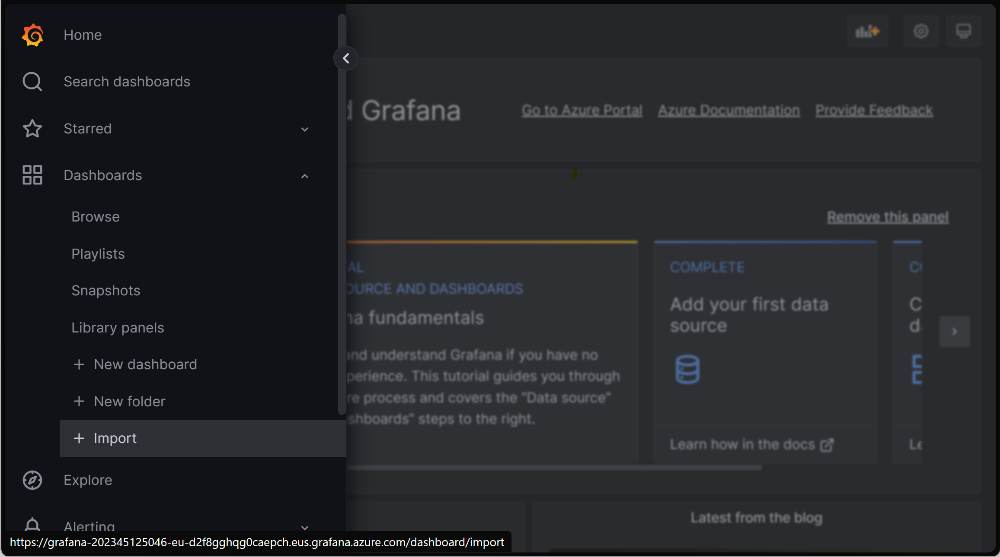
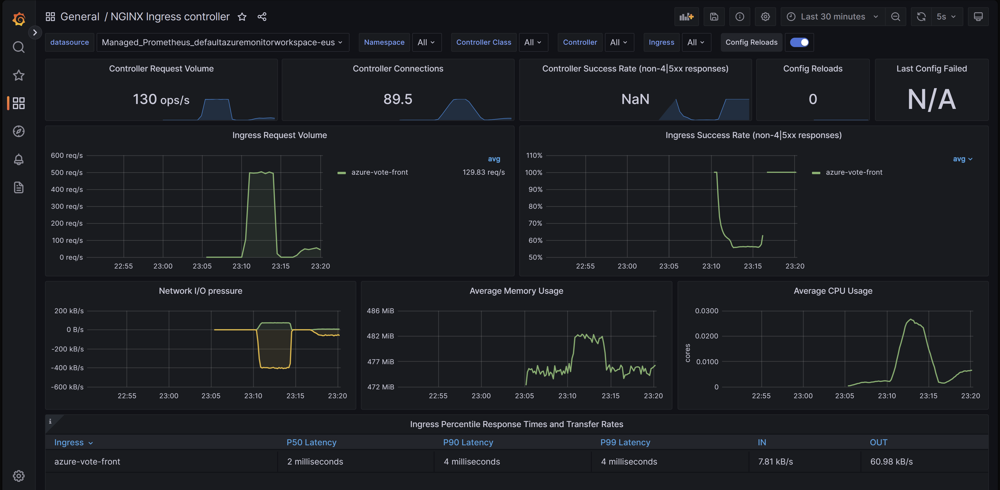

# Monitor the ingress-nginx controller metrics in the application routing add-on with Prometheus (preview)

The ingress-nginx controller in the application routing add-on exposes many metrics for requests, the nginx process, and the controller that can be helpful in analyzing the performance and usage of your application.

The application routing add-on exposes the Prometheus metrics endpoint at `/metrics` on port 10254.

[!INCLUDE [preview features callout](./includes/preview/preview-callout.md)]

## Prerequisites

- An Azure Kubernetes Service (AKS) cluster with the [application routing add-on enabled][app-routing].
- A Prometheus instance, such as [Azure Monitor managed service for Prometheus][managed-prometheus].
- A Grafana instance, such as [Azure Managed Grafana][managed-grafana].

## Validating the metrics endpoint

To validate the metrics are being collected, you can set up a port forward to one of the ingress-nginx controller pods.

```bash
kubectl get pods -n app-routing-system
NAME                            READY   STATUS    RESTARTS   AGE
external-dns-667d54c44b-jmsxm   1/1     Running   0          4d6h
nginx-657bb8cdcf-qllmx          1/1     Running   0          4d6h
nginx-657bb8cdcf-wgcr7          1/1     Running   0          4d6h
```

Now forward a local port to port 10254 on one of the nginx pods.

```bash
kubectl port-forward nginx-657bb8cdcf-qllmx -n app-routing-system :10254
Forwarding from 127.0.0.1:43307 -> 10254
Forwarding from [::1]:43307 -> 10254
```

Note the local port (`43307` in this case) and open http://localhost:43307/metrics in your browser. You should see the ingress-nginx controller metrics loading.



You can now terminate the `port-forward` process to close the forwarding.

## Configuring Azure Monitor managed service for Prometheus and Azure Managed Grafana using Container Insights

Azure Monitor managed service for Prometheus is a fully managed Prometheus-compatible service that supports industry standard features such as PromQL, Grafana dashboards, and Prometheus alerts. This service requires configuring the metrics addon for the Azure Monitor agent, which sends data to Prometheus. If your cluster isn't configuredfwith the add-on, you can follow this article to [configure your Azure Kubernetes Service (AKS) cluster to send data to Azure Monitor managed service for Prometheus][managed-prometheus-configure] and send the collected metrics to [an Azure Managed Grafana instance][create-grafana].

### Enable pod annotation based scraping

Once your cluster is configured with the Azure Monitor agent, [apply a ConfigMap to provide scraping configuration][managed-prometheus-custom-annotations] called `ama-metrics-prometheus-config` in the `kube-system` namespace to enable the agent to scrape based on Pod annotations, which are added to the ingress-nginx pods.

> [!CAUTION]
> This will replace your existing `ama-metrics-prometheus-config` ConfigMap in the `kube-system`. If you already have a configuration, you may want to take a backup or merge it with this configuration.

```bash
kubectl apply -f - <<EOF
kind: ConfigMap
apiVersion: v1
metadata:
  name: ama-metrics-prometheus-config
  namespace: kube-system
data:
  prometheus-config: |-
    global:
      scrape_interval: 10s
    scrape_configs:
    - job_name: kubernetespods-sample

      kubernetes_sd_configs:
      - role: pod

      relabel_configs:
      # Scrape only pods with the annotation: prometheus.io/scrape = true
      - source_labels: [__meta_kubernetes_pod_annotation_prometheus_io_scrape]
        action: keep
        regex: true

      # If prometheus.io/path is specified, scrape this path instead of /metrics
      - source_labels: [__meta_kubernetes_pod_annotation_prometheus_io_path]
        action: replace
        target_label: __metrics_path__
        regex: (.+)

      # If prometheus.io/scheme is specified, scrape with this scheme instead of http
      - source_labels: [__meta_kubernetes_pod_annotation_prometheus_io_scheme]
        action: replace
        regex: (http|https)
        target_label: __scheme__

      # Include the pod namespace as a label for each metric
      - source_labels: [__meta_kubernetes_namespace]
        action: replace
        target_label: kubernetes_namespace

      # Include the pod name as a label for each metric
      - source_labels: [__meta_kubernetes_pod_name]
        action: replace
        target_label: kubernetes_pod_name

      # [Optional] Include all pod labels as labels for each metric
      - action: labelmap
        regex: __meta_kubernetes_pod_label_(.+)
EOF
```

In a few minutes, the `ama-metrics` pods in the `kube-system` namespace should restart and pick up the new configuration.

## Review visualization of metrics in Azure Managed Grafana

Now that you have Azure Monitor managed service for Prometheus and Azure Managed Grafana configured, you should [access your Managed Grafana instance][access-grafana].

There are two [official ingress-nginx dashboards](https://github.com/kubernetes/ingress-nginx/tree/main/deploy/grafana/dashboards) dashboards that you can download and import into your Grafana instance:

- Ingress-nginx controller dashboard
- Request handling performance dashboard

To import a Grafana dashboard, expand the left menu and click on **Import** under Dashboards.



Then upload the desired dashboard file and click on **Load**.


### Ingress-nginx controller dashboard



**Features**

- Ability to filter by Namespace, Controller Class and Controller
- Visibility of Request Volume, connections, success rates, config reloads and configs out of sync.
- Network IO pressure, memory and CPU use
- Ingress P50, P95 and P99 percentile response times with IN/OUT throughput
- Annotational overlays to show when config reloads happened

### Request handling performance dashboard


**Features**

- Ability to filter by Ingress
- P50, P95 and P99 percentile of total request and upstream response times
- Request volume by path
- Error volume and error rate by path
- Average response time by path

## Next steps

You can configure scaling your workloads using ingress metrics scraped with Prometheus using [Kubernetes Event Driven Autoscaler (KEDA)][KEDA].

Learn more about [integrating KEDA with AKS][keda-prometheus].

<!-- LINKS - internal -->
[az-aks-create]: /cli/azure/aks#az-aks-create
[app-routing]: ./app-routing
[managed-prometheus]: /azure-monitor/essentials/prometheus-metrics-overview
[managed-prometheus-configure]: /azure-monitor/containers/container-insights-prometheus
[managed-prometheus-custom-annotations]: /azure-monitor/essentials/prometheus-metrics-scrape-configuration#pod-annotation-based-scraping
[managed-grafana]: /managed-grafana/overview
[create-grafana]: /managed-grafana/quickstart-managed-grafana-portal
[access-grafana]: /managed-grafana/quickstart-managed-grafana-portal#access-your-managed-grafana-instance
[keda]: /keda-about
[keda-prometheus]: /azure-monitor/essentials/integrate-keda#scalers
[az-aks-show]: /cli/azure/aks#az-aks-show
[az-aks-enable-addons]: /cli/azure/aks#az-aks-enable-addons
[az-aks-disable-addons]: /cli/azure/aks#az-aks-disable-addons
[az-aks-install-cli]: /cli/azure/aks#az-aks-install-cli
[az-aks-get-credentials]: /cli/azure/aks#az-aks-get-credentials
[az-extension-add]: /cli/azure/extension#az-extension-add
[az-extension-update]: /cli/azure/extension#az-extension-update
[install-azure-cli]: /cli/azure/install-azure-cli
[az-keyvault-create]: /cli/azure/keyvault#az_keyvault_create
[az-keyvault-certificate-import]: /cli/azure/keyvault/certificate#az_keyvault_certificate_import
[az-keyvault-certificate-show]: /cli/azure/keyvault/certificate#az_keyvault_certificate_show
[az-network-dns-zone-create]: /cli/azure/network/dns/zone#az_network_dns_zone_create
[az-network-dns-zone-show]: /cli/azure/network/dns/zone#az_network_dns_zone_show
[az-role-assignment-create]: /cli/azure/role/assignment#az_role_assignment_create
[az-aks-addon-update]: /cli/azure/aks/addon#az_aks_addon_update
[az-keyvault-set-policy]: /cli/azure/keyvault#az_keyvault_set_policy

<!-- LINKS - external -->
[osm-release]: https://github.com/openservicemesh/osm/releases/
[nginx]: https://kubernetes.github.io/ingress-nginx/
[external-dns]: https://github.com/kubernetes-incubator/external-dns
[kubectl]: https://kubernetes.io/docs/reference/kubectl/
[kubectl-apply]: https://kubernetes.io/docs/reference/generated/kubectl/kubectl-commands#apply
