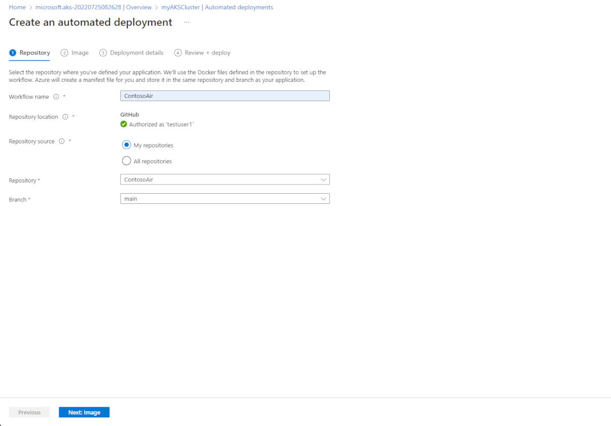
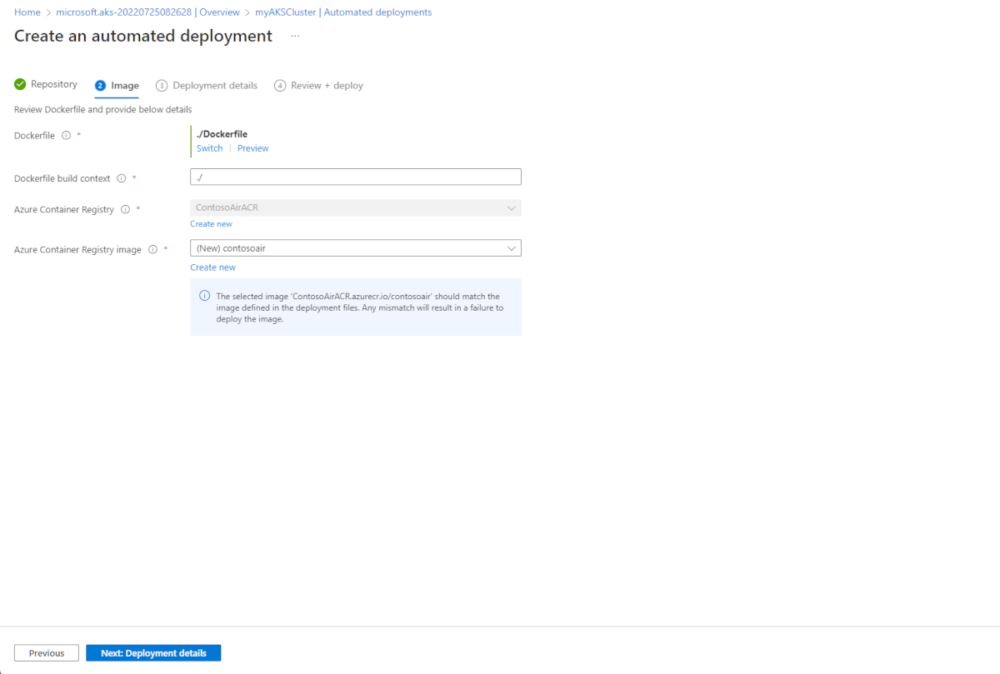
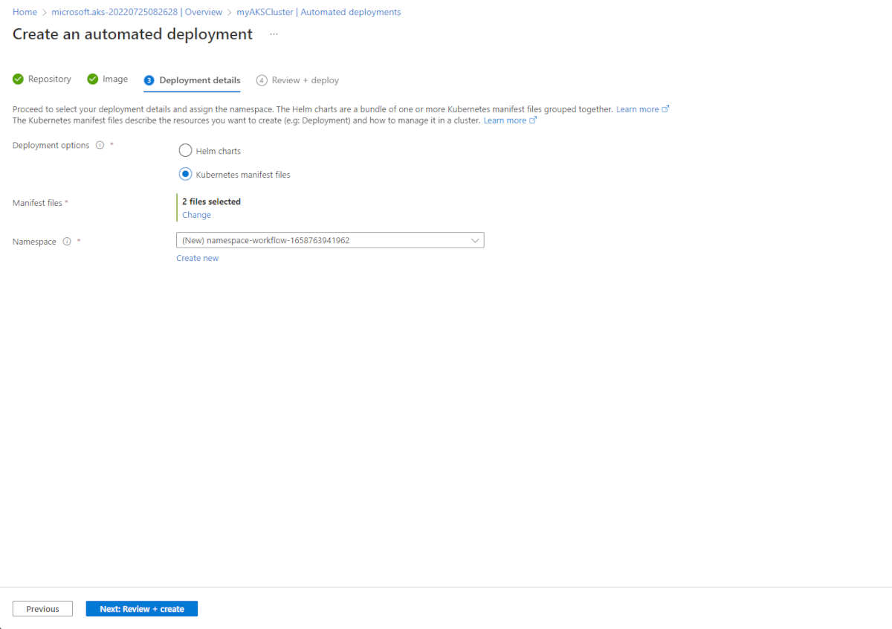
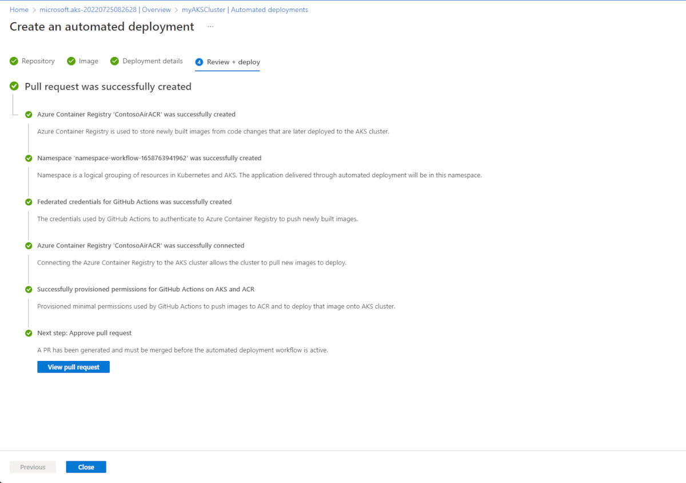
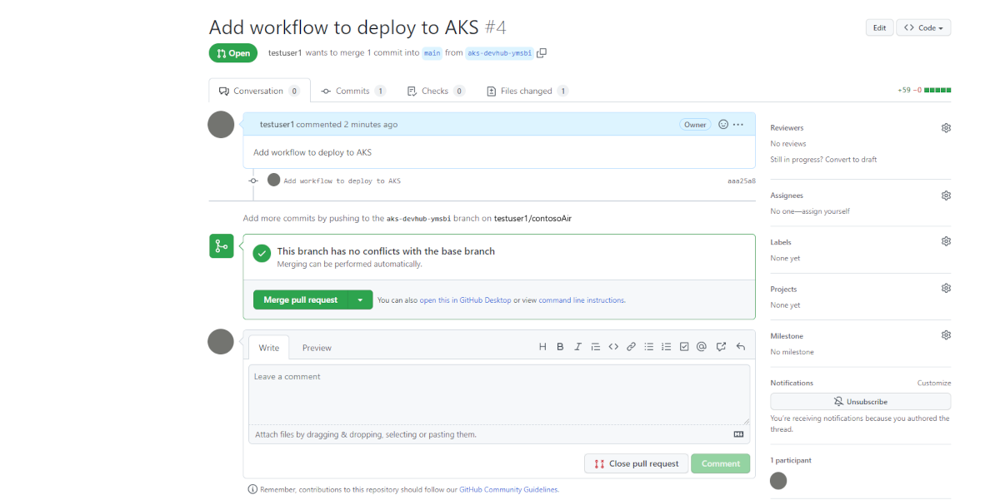
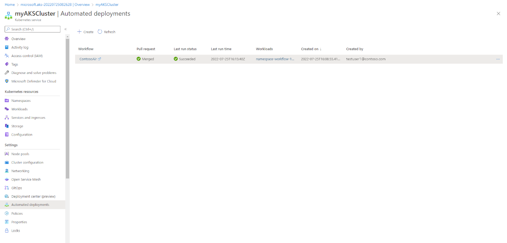

# Automated Deployments for Azure Kubernetes Service

Automated Deployments simplifies the process of setting up a GitHub Action and creating an automated pipeline for your code releases to your Azure Kubernetes Service (AKS) cluster. Once connected, every new commit will kick off the pipeline, resulting in your application being updated.

## Prerequisites

* A GitHub account.
* An AKS cluster.

## Deploy an application to your AKS cluster

1. In the Azure Portal, navigate to the resource group containing the AKS cluster you want to deploy the application to.

1. Select your AKS cluster, and then select **Automated deployments (preview)** on the left blade. Select **Create an automated deployment**.

   

1. Name your workflow and click **Authorize** to connect your Azure account with your GitHub account. After your accounts are linked, choose which repository and branch you would like to create the GitHub Action for.

    - **GitHub**: Authorize and select the repository for your GitHub account.

        

1. Pick your dockerfile as well as your Azure Container Registry (ACR) and image.

    

1. Determine whether you will deploy with Helm or regular Kubernetes manifests. Once decided, pick the appropriate deployment files from your repository and decide which namespace you want to deploy into.

    

1. Review your deployment before creating the pull request.

1. Click **view pull request** to see your GitHub Action.

    

1. Merge the pull request to kick off the GitHub Action and deploy your application.

    

1. Once your application is deployed, go back to automated deployments to see your history.

    

## Clean up resources

You can remove any related resources that you created when you don't need them anymore individually or by deleting the resource group to which they belong. To delete your automated deployment, navigate to the automated deployment dashboard and select **...**, then select **delete** and confirm your action.

## Next steps

You can modify these GitHub Actions to meet the needs of your team by opening them up in an editor like Visual Studio Code and changing them as you see fit.

Learn more about [GitHub Actions for Kubernetes][kubernetes-action.md].
