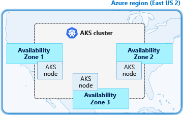

# Availability zones in Azure Kubernetes Service (AKS) overview

This article provides an overview of using availability zones in Azure Kubernetes Service (AKS) to increase the availability of your applications.

An AKS cluster distributes resources, such as nodes and storage, across logical sections of underlying Azure infrastructure. Using availability zones physically separates nodes from other nodes deployed to different availability zones. AKS clusters deployed with multiple availability zones configured across a cluster provide a higher level of availability to protect against a hardware failure or a planned maintenance event.

## What are availability zones?

Availability zones help protect your applications and data from datacenter failures. Zones are unique physical locations within an Azure region. Each zone includes one or more datacenters equipped with independent power, cooling, and networking. To ensure resiliency, there's always more than one zone in all zone enabled regions. The physical separation of availability zones within a region protects applications and data from datacenter failures.

AKS clusters deployed using availability zones can distribute nodes across multiple zones within a single region. For example, a cluster in the *East US 2* region can create nodes in all three availability zones in *East US 2*. This distribution of AKS cluster resources improves cluster availability as they're resilient to failure of a specific zone.



If a single zone becomes unavailable, your applications continue to run on clusters configured to spread across multiple zones.

For more information, see [Using Azure availability zones](../reliability/availability-zones-overview.md).

> [!NOTE]
> When implementing **availability zones with the [cluster autoscaler](./cluster-autoscaler-overview.md)**, we recommend using a single node pool for each zone. You can set the `--balance-similar-node-groups` parameter to `true` to maintain a balanced distribution of nodes across zones for your workloads during scale up operations. When this approach isn't implemented, scale down operations can disrupt the balance of nodes across zones. This configuration doesn't guarantee that similar node groups will have the same number of nodes:
>
> * Currently, balancing happens during scale up operations only. The cluster autoscaler scales down underutilized nodes regardless of the relative sizes of the node groups.
> * The cluster autoscaler only adds as many nodes as required to run all existing pods. Some groups might have more nodes than others if they have more pods scheduled.
> * The cluster autoscaler only balances between node groups that can support the same set of pending pods.
>
> You can also use Azure zone-redundant storage (ZRS) disks to replicate your storage across three availability zones in the region you select. A ZRS disk lets you recover from availability zone failure without data loss. For more information, see [ZRS for managed disks](../virtual-machines/disks-redundancy.md#zone-redundant-storage-for-managed-disks).

## Limitations

The following limitations apply when you create an AKS cluster using availability zones:

* You can only define availability zones during creation of the cluster or node pool.
* It is not possible to update an existing non-availability zone cluster to use availability zones after creating the cluster.
* The chosen node size (VM SKU) selected must be available across all availability zones selected.
* Clusters with availability zones enabled require using Azure Standard Load Balancers for distribution across zones. You can only define this load balancer type at cluster create time. For more information and the limitations of the standard load balancer, see [Azure load balancer standard SKU limitations][standard-lb-limitations].

## Azure Disk availability zones support

Volumes that use Azure managed LRS disks aren't zone-redundant resources, and attaching across zones isn't supported. You need to colocate volumes in the same zone as the specified node hosting the target pod. Volumes that use Azure managed ZRS disks are zone-redundant resources. You can schedule those volumes on all zone and non-zone agent nodes. The following example shows how to create a storage class using the *StandardSSD_ZRS* disk:

```yaml
apiVersion: storage.k8s.io/v1
kind: StorageClass
metadata:
  name: managed-csi-zrs
provisioner: disk.csi.azure.com
parameters:
  skuName: StandardSSD_ZRS  # or Premium_ZRS
reclaimPolicy: Delete
volumeBindingMode: WaitForFirstConsumer
allowVolumeExpansion: true
```

Kubernetes versions 1.12 and higher are aware of Azure availability zones. You can deploy a PersistentVolumeClaim object referencing an Azure Managed Disk in a multi-zone AKS cluster and [Kubernetes takes care of scheduling](https://kubernetes.io/docs/setup/best-practices/multiple-zones/#storage-access-for-zones) any pod that claims this PVC in the correct availability zone.

Effective from Kubernetes version 1.29, when you deploy Azure Kubernetes Service (AKS) clusters across multiple availability zones, AKS now utilizes zone-redundant storage (ZRS) to create managed disks within built-in storage classes. ZRS ensures synchronous replication of your Azure managed disk across three Azure availability zones in your chosen region. This redundancy strategy enhances the resilience of your applications and safeguards your data against datacenter failures.

However, it's important to note that zone-redundant storage (ZRS) comes at a higher cost compared to locally redundant storage (LRS). If cost optimization is a priority, consider adjusting the skuname parameter to use Azure LRS managed disks in the storage class associated with your Persistent Volume Claim (PVC).

## Next steps

* [Create an AKS cluster with availability zones](./availability-zones.md).

<!-- LINKS -->
[standard-lb-limitations]: load-balancer-standard.md#limitations