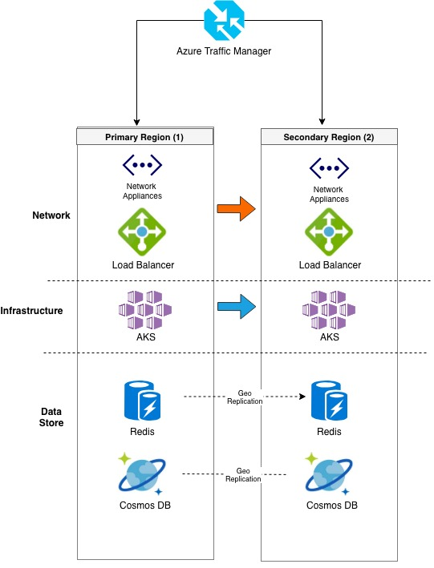
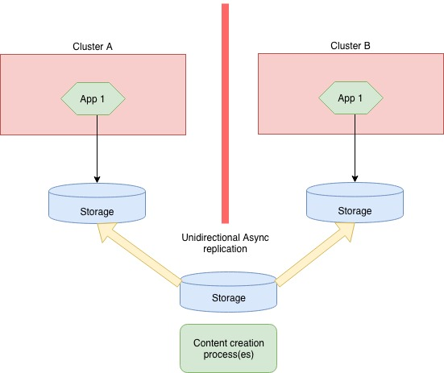
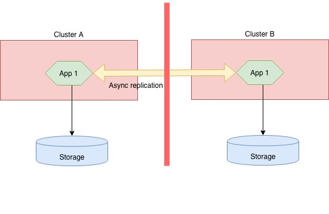

# Best practices for Business Continuity and Disaster Recovery in Azure Kubernetes Service (AKS)

As you manage clusters in Azure Kubernetes Service (AKS) and your application uptime becomes more vital, you may want to consider removing Single Point of Failures and increasing the application's fault tolerance.  AKS supports High Availability through using multiple VM’s in an Availability Set; however, this doesn’t protect you from a region failure.  To maximize your uptime, these Business Continuity and Disaster Recovery recommendations should be understood and implemented.

This best practices article focuses on considerations that help you plan for Business Continuity / Disaster Recovery in AKS:

> [!div class="checklist"]
* [Region Planning](#region-planning)
* [Ingress Traffic](#ingress-traffic)
* [Container Registry](#container-registry)
* [Managing Application State](#managing-application-state)
* [Storage](#storage)

## Plan for Multi-region Deployment

**Best practice guidance** - When deploying multiple AKS clusters for BC/DR, use regions where both AKS clusters are available that are also Azure Paired Regions.

An AKS cluster is deployed into a single region. To protect yourself from region failure, deploy your application into separate AKS clusters, each deployed in a different region.  When planning which regions to deploy your AKS cluster, you should consider:

* [AKS Region Availibility](https://docs.microsoft.com/en-us/azure/aks/container-service-quotas#region-availability)
* [Azure Paired Regions](https://docs.microsoft.com/en-us/azure/best-practices-availability-paired-regions)
* Service Availibility Level (Hot/Hot, Hot/Warm, Hot/Cold)

AKS Region Availibility and Azure Paired Regions should be considered jointly so that you deploy your AKS clusters into paired regions that are designed to manage region disaster recovery together.

For example, AKS is available in East US and West US, which are also Paired Regions, so these two regions are recommended when creating an AKS BC/DR strategy.

When deploying your application, it's required to add another step to your CI/CD pipeline to deploy to the Paired Region.

## Use Azure Traffic Manager to Route Traffic to Desired Region

**Best practice guidance** - Ensure that all application traffic is directed through Azure Traffic Manager before going to your AKS cluster.

To support routing incoming traffic to the desired region, use [Azure Traffic Manager](https://docs.microsoft.com/en-us/azure/traffic-manager/).  Azure Traffic Manager is a DNS-based traffic load balancer that can distribute network traffic across regions.

Instead of directly publishing your Kubernetes Service IP, end users should be directed to the Azure Traffic Manager CNAME which will direct the users to the intended IP.  This can be setup by using Azure Traffic Manager Endpoints.  Each endpoint will be the Service Load Balancer IP allowing you to direct network traffic to from the Azure Endpoint in one region to the Azure Endpoint in a different region.

For details on how to implement this, see [Traffic Manager Routing Details](https://docs.microsoft.com/en-us/azure/traffic-manager/traffic-manager-routing-methods#geographic).

While Azure Traffic Manager uses DNS (Layer 3) to shape traffic, [Azure Front Door (preview)](https://docs.microsoft.com/en-us/azure/frontdoor/front-door-overview) provides an HTTP/HTTPS (Layer 7) routing option.  Additional features include SSL termination, custom domain, Web Appplication Firewall, URL Rewrite and Session Affinity.

## Enable Geo-Replication in Azure Container Registry

**Best pratice guidance** - Store all of your container images in Azure Container Registry with geo-replication enabled for each AKS region.

Since Azure Container Registry supports multi-master geo-replication, it is recommend to use ACR geo-replication to store a registry in each region your AKS cluster resides.

Benefits of using ACR Geo-replication are:

* Pulling images from within the same region is faster
* Pulling images from within the same region is more reliable
* Pulling images from within the same region is cheaper (no network egress charge between datacenters)

For details on how to implement this, see [Azure Container Registry Geo Replication](https://docs.microsoft.com/en-us/azure/container-registry/container-registry-geo-replication)

## Remove Service State From Inside Containers

**Best practice guidance** - Where possible, do not store service state inside the container.  Instead, use Azure PaaS services which support multi-region replication.

Service state refers to the in-memory or on-disk data that a service requires to function. It includes, for example, the data structures and member variables that the service reads and writes to do work. Depending on how the service is architected, it could also include files or other resources that are stored on disk. For example, the files a database would use to store data and transaction logs.

State can be either externalized or co-located with the code that is manipulating the state. Externalization of state is typically done by using an external database or other data store that runs on different machines over the network or out of process on the same machine.

Containers and Microservices are most resilient when the processes that run inside them do not retain state.  Your application will almost always contain some state, and it is recommended to use a Platform as a Service solution (e.g. Azure Database for MySQL/Postgres, Azure SQL, etc.).  

For details on for how to build applications that are more portable, please review the following guidelines:

* [The Twelve-Factor App Methodology](https://12factor.net/).
* [Run a web application in multiple Azure Regions](https://docs.microsoft.com/en-us/azure/architecture/reference-architectures/app-service-web-app/multi-region)

## Create a Storage Migration Plan

**Best practice guidance** - If using Azure Storage, then prepare and test how you plan to migrate your storage from the primary to the backup region.

Two common ways of replicating storage are:

* Application-based Asynchronous Replication
* Infrastructure-based Asynchronous Replication

### Infrastructure-based Asynchronous Replication

Sometimes your application requires persistent storage even after the pod is deleted.  Kubernetes enables this through Persistent Volumes which are mounted to host VM and then to the containers running on that VM.  Persistent Volumes will follow Pods, even if the Pod is moved to a different node inside the same cluster.

Depending on the storage solution you pick, BC/DR strategies will depend.   For example, [Gluster](https://docs.gluster.org/en/latest/Administrator%20Guide/Geo%20Replication/), [CEPH](http://docs.ceph.com/docs/master/cephfs/disaster-recovery/), [Rook](https://rook.io/docs/rook/master/disaster-recovery.html), [Portworx](https://docs.portworx.com/scheduler/kubernetes/going-production-with-k8s.html#disaster-recovery-with-cloudsnaps), etc. will have their own guidance.

If using Azure Managed Disks, the recommended approaches to migrate storage across regions are:

* [Ark on Azure](https://github.com/heptio/ark/blob/master/docs/azure-config.md)
* [Azure Site Recovery](https://azure.microsoft.com/en-us/blog/asr-managed-disks-between-azure-regions/)

### Application-based Asynchronous Replication

Currently, there are no Kubernetes native implementations for Application-based Asynchronous Replication.  Due to the loosely coupled nature of containers and Kubernetes, any traditional application/language approach should work.
