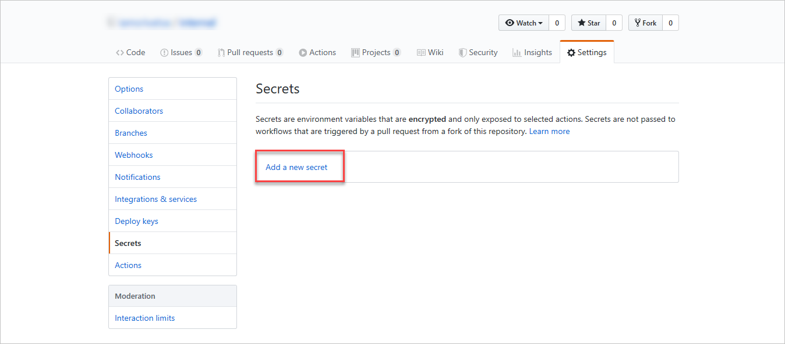
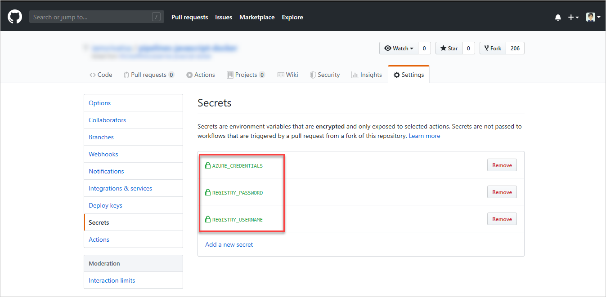

# GitHub Actions for deploying to Kubernetes service

[GitHub Actions](https://help.github.com/en/articles/about-github-actions) gives you the flexibility to build an automated software development lifecycle workflow. The Kubernetes action [azure/aks-set-context@v1]((https://github.com/Azure/aks-set-context)) facilitate deployments to Azure Kubernetes Service clusters. The action sets the target AKS cluster context which could be used by other actions like [azure/k8s-deploy](https://github.com/Azure/k8s-deploy/tree/master), [azure/k8s-create-secret](https://github.com/Azure/k8s-create-secret/tree/master) etc. or run any kubectl commands.

> [!IMPORTANT]
> GitHub Actions is currently in beta. You must first [sign-up to join the preview](https://github.com/features/actions) using your GitHub account.
> 

A workflow is defined by a YAML (.yml) file in the `/.github/workflows/` path in your repository. This definition contains the various steps and parameters that make up the workflow.

For a workflow targeting AKS, the file has three sections:

|Section  |Tasks  |
|---------|---------|
|**Authentication** | 1. Define a service principal |
|                   | 2. Create a GitHub secret     |
|**Build** | 1. Build the container image |
|**Deploy** | 1. Deploy to the K8s cluster |

## Create a service principal

You can create a [service principal](https://docs.microsoft.com/azure/active-directory/develop/app-objects-and-service-principals#service-principal-object) by using the [az ad sp create-for-rbac](https://docs.microsoft.com/cli/azure/ad/sp?view=azure-cli-latest#az-ad-sp-create-for-rbac) command in the [Azure CLI](https://docs.microsoft.com/cli/azure/). You can run this command using [Azure Cloud Shell](https://shell.azure.com/) in the Azure portal or by selecting the **Try it** button.

```azurecli-interactive
az ad sp create-for-rbac --name "myApp" --role contributor --scopes /subscriptions/<SUBSCRIPTION_ID>/resourceGroups/<RESOURCE_GROUP> --sdk-auth
```

In this example, replace the placeholders in the resource with your subscription ID, and resource group. The output is the role assignment credentials that provide access to your resource. Copy this JSON object, which you can use to authenticate from GitHub.

## Configure the GitHub secrets

Follow the steps to configure the secret:

1. In [GitHub](https://github.com/), browse your repository, select **Settings > Secrets > Add a new secret**.

    

2. Paste the contents of the above `az cli` command as the value of secret variable. For example, `AZURE_CREDENTIALS`.

3. Similarly, define the following additional secrets for the container registry credentials and set them in Docker login action. 

    - REGISTRY_USERNAME
    - REGISTRY_PASSWORD

4. You will see the secrets as shown below once defined.

    

## Deploy the Container Image

To deploy the container image to AKS, you will need to use the `Azure/k8s-deploy@v1` action. This action has five parameters:

| **Parameter**  | **Explanation**  |
|---------|---------|
| **namespace** | (Optional) Choose the target Kubernetes namespace. If the namespace is not provided, the commands will run in the default namespace | 
| **manifests** |  (Required) Path to the manifest files, that will be used for deployment |
| **images** | (Optional) Fully qualified resource URL of the image(s) to be used for substitutions on the manifest files |
| **imagepullsecrets** | (Optional) Name of a docker-registry secret that has already been set up within the cluster. Each of these secret names is added under imagePullSecrets field for the workloads found in the input manifest files |
| **kubectl-version** | (Optional) Installs a specific version of kubectl binary |

### Deploy to Azure Kubernetes Service cluster

End to end workflow for building container images and deploying to an Azure Kubernetes Service cluster.

```yaml
on: [push]

jobs:
  build:
    runs-on: ubuntu-latest
    steps:
    - uses: actions/checkout@master
    
    - uses: Azure/docker-login@v1
      with:
        login-server: contoso.azurecr.io
        username: ${{ secrets.REGISTRY_USERNAME }}
        password: ${{ secrets.REGISTRY_PASSWORD }}
    
    - run: |
        docker build . -t contoso.azurecr.io/k8sdemo:${{ github.sha }}
        docker push contoso.azurecr.io/k8sdemo:${{ github.sha }}
      
    # Set the target AKS cluster.
    - uses: Azure/aks-set-context@v1
      with:
        creds: '${{ secrets.AZURE_CREDENTIALS }}'
        cluster-name: contoso
        resource-group: contoso-rg
        
    - uses: Azure/k8s-create-secret@v1
      with:
        container-registry-url: contoso.azurecr.io
        container-registry-username: ${{ secrets.REGISTRY_USERNAME }}
        container-registry-password: ${{ secrets.REGISTRY_PASSWORD }}
        secret-name: demo-k8s-secret

    - uses: Azure/k8s-deploy@v1
      with:
        manifests: |
          manifests/deployment.yml
          manifests/service.yml
        images: |
          demo.azurecr.io/k8sdemo:${{ github.sha }}
        imagepullsecrets: |
          demo-k8s-secret
```

## Next

You can find our set of Actions in different repositories on GitHub, each one containing documentation and examples to help you use GitHub for CI/CD and deploy your apps to Azure.

- [setup-kubectl](https://github.com/Azure/setup-kubectl)

- [k8s-set-context](https://github.com/Azure/k8s-set-context)

- [aks-set-context](https://github.com/Azure/aks-set-context)

- [k8s-create-secret](https://github.com/Azure/k8s-create-secret)

- [k8s-deploy](https://github.com/Azure/k8s-deploy)

- [webapps-container-deploy](https://github.com/Azure/webapps-container-deploy)

- [actions-workflow-samples](https://github.com/Azure/actions-workflow-samples)
