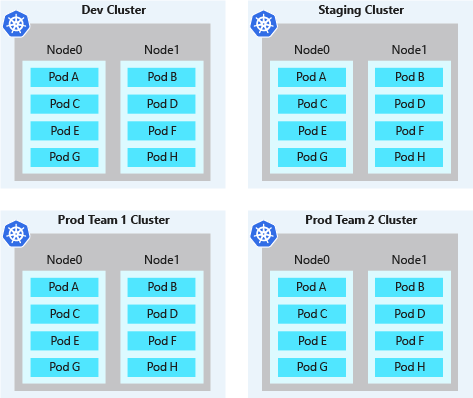

# Best practices for cluster isolation in Azure Kubernetes Service (AKS)

As you manage clusters in Azure Kubernetes Service (AKS), you often need to isolate teams and workloads. AKS provides flexibility in how you can run multi-tenant clusters and isolate resources. To maximize your investment in Kubernetes, these multi-tenancy and isolation features should be understood and implemented.

This best practices article focuses on isolation for cluster operators. In this article, you learn how to:

> [!div class="checklist"]
> * Plan for multi-tenant clusters and separation of resources
> * Use logical or physical isolation in your AKS clusters

## Design clusters for multi-tenancy

Kubernetes provides features that let you logically isolate teams and workloads in the same cluster. The goal should be to provide the least number of privileges, scoped to the resources each team needs. A [Namespace][k8s-namespaces] in Kubernetes creates a logical isolation boundary. Additional kubernetes features and considerations for isolation and multi-tenancy include the following areas:

* **Scheduling** includes the use of basic features such as resource quotas and pod disruption budgets. For more information about these features, see [Best practices for basic scheduler features in AKS][aks-best-practices-scheduler].
  * More advanced scheduler features include taints and tolerations, node selectors, and node and pod affinity or anti-affinity. For more information about these features, see [Best practices for advanced scheduler features in AKS][aks-best-practices-advanced-scheduler].
* **Networking** includes the use of network policies to control the flow of traffic in and out of pods.
* **Authentication and authorization** include the user of role-based access control (RBAC) and Azure Active Directory (AD) integration, pod identities, and secrets in Azure Key Vault. For more information about these features, see [Best practices for authentication and authorization in AKS][aks-best-practices-identity].
* **Containers** include pod security policies, pod security contexts, scanning images and runtimes for vulnerabilities, and App Armor or Seccomp (Secure Computing) to restrict container access to the underlying node.

## Logically isolate clusters

**Best practice guidance** - Use logical isolation to separate teams and projects. You can use logical isolation alongside physical isolation, but try to minimize the number of physical AKS clusters you deploy just to separate teams or applications.

With logical isolation, a single AKS cluster can be used for multiple workloads, teams, or environments. Kubernetes [Namespaces][k8s-namespaces] form the logical isolation boundary for workloads and resources.

Logical separation of clusters usually provides a higher pod density than physically isolated clusters. There is less excess compute capacity that sits idle in the cluster. When combined with the Kubernetes cluster autoscaler, you can scale the number of nodes up or down to meet demands. This best practice approach to autoscaling lets you run only the number of nodes required and minimizes costs.

## Physically isolate clusters

**Best practice guidance** - Minimize the use of physical isolation for each separate team or application deployment. Instead, use *logical* isolation, as discussed in the previous section.

A common approach to cluster isolation is to use physically separate AKS clusters. In this isolation model, teams or workloads are assigned their own AKS cluster. This approach often looks like the easiest way to isolate workloads or teams, but adds additional management and financial overhead. You now have to maintain these multiple clusters, are billed for all the individual nodes, and have to individually provide access and assign permissions.

Physically separate clusters usually have a low pod density. As each team or workload has their own AKS cluster, the cluster is often over-provisioned with compute resources, with a small number of pods scheduled on those nodes. Unused capacity on the nodes cannot be used for applications or services in development by other teams. These excess resources contribute to the additional costs in physically separate clusters.

## Next steps

This article focused on cluster isolation. For more information about cluster operations in AKS, see the following best practices:

* [Basic Kubernetes scheduler features][aks-best-practices-scheduler]
* [Advanced Kubernetes scheduler features][aks-best-practices-advanced-scheduler]
* [Authentication and authorization][aks-best-practices-identity]

<!-- EXTERNAL LINKS -->

<!-- INTERNAL LINKS -->
[k8s-namespaces]: concepts-clusters-workloads.md#namespaces
[aks-best-practices-scheduler]: operator-best-practices-scheduler.md
[aks-best-practices-advanced-scheduler]: operator-best-practices-advanced-scheduler.md
[aks-best-practices-identity]: operator-best-practices-identity.md
