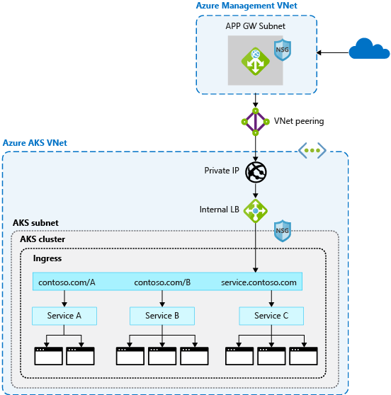
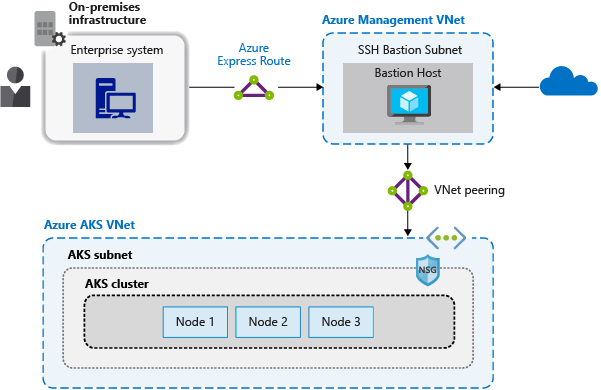

# Best practices for network connectivity and security in Azure Kubernetes Service (AKS)

As you create and manage clusters in Azure Kubernetes Service (AKS), you provide network connectivity for your nodes and applications. These network resources include IP address ranges, load balancers, and ingress controllers. To maintain a high quality of service for your applications, you need to plan for and then configure these resources.

This best practices article focuses on network connectivity and security for cluster operators. In this article, you learn how to:

> [!div class="checklist"]
> * Compare the basic and advanced network modes in AKS
> * Plan for required IP addressing and connectivity
> * Distribute traffic using load balancers, ingress controllers, or a web application firewalls (WAF)
> * Securely connect to cluster nodes

## Choose the appropriate network model

**Best practice guidance** - For integration with existing virtual networks or on-premises networks, use advanced networking in AKS. This network model also allows greater separation of resources and controls in an enterprise environment.

Virtual networks provide the basic connectivity for AKS nodes and customers to access your applications. There are two different ways to deploy AKS clusters into virtual networks:

* **Basic networking** - Azure manages the virtual network resources as the cluster is deployed and uses the [kubenet][kubenet] Kubernetes plugin.
* **Advanced networking** - Deploys into an existing virtual network, and uses the [Azure Container Networking Interface (CNI)][cni-networking] Kubernetes plugin. Pods receive individual IPs that can route to other network services or on-premises resources.

The Container Networking Interface (CNI) is a vendor-neutral protocol that lets the container runtime make requests to a network provider. The Azure CNI assigns IP addresses to pods and nodes, and provides IP address management (IPAM) features as you connect to existing Azure virtual networks. Each node and pod resource receives an IP address in the Azure virtual network, and no additional routing is needed to communicate with other resources or services.


For most production deployments, you should use advanced networking. This network model allows for separation of control and management of resources. From a security perspective, you often want different teams to manage and secure those resources. Advanced networking lets you connect to existing Azure resources, on-premises resources, or other services directly via IP addresses assigned to each pod.

When you use advanced networking, the virtual network resource is in a separate resource group to the AKS cluster. Delegate permissions for the AKS service principal to access and manage these resources. The service principal used by the AKS cluster must have at least [Network Contributor](../role-based-access-control/built-in-roles.md#network-contributor) permissions on the subnet within your virtual network. If you wish to define a [custom role](../role-based-access-control/custom-roles.md) instead of using the built-in Network Contributor role, the following permissions are required:
  * `Microsoft.Network/virtualNetworks/subnets/join/action`
  * `Microsoft.Network/virtualNetworks/subnets/read`

For more information about AKS service principal delegation, see [Delegate access to other Azure resources][sp-delegation].

As each node and pod receive its own IP address, plan out the address ranges for the AKS subnets. The subnet must be large enough to provide IP addresses for every node, pods, and network resources that you deploy. Each AKS cluster must be placed in its own subnet. To allow connectivity to on-premises or peered networks in Azure, don't use IP address ranges that overlap with existing network resources. There are default limits to the number of pods that each node runs with both basic and advanced networking. To handle scale up events or cluster upgrades, you also need additional IP addresses available for use in the assigned subnet.

To calculate the IP address required, see [Configure advanced networking in AKS][advanced-networking].

### Basic networking with Kubenet

Although basic networking doesn't require you to set up the virtual networks before the cluster is deployed, there are disadvantages:

* Nodes and pods are placed on different IP subnets. User Defined Routing (UDR) and IP forwarding is used to route traffic between pods and nodes. This additional routing reduces network performance.
* Connections to existing on-premises networks or peering to other Azure virtual networks is complex.

Basic networking is suitable for small development or test workloads, as you don't have to create the virtual network and subnets separately from the AKS cluster. Simple websites with low traffic, or to lift and shift workloads into containers, can also benefit from the simplicity of AKS clusters deployed with basic networking. For most production deployments, you plan for and use advanced networking.

## Distribute ingress traffic

**Best practice guidance** - To distribute HTTP or HTTPS traffic to your applications, use ingress resources and controllers. Ingress controllers provide additional features over a regular Azure load balancer, and can be managed as native Kubernetes resources.

An Azure load balancer can distribute customer traffic to applications in your AKS cluster, but it's limited in what it understands about that traffic. A load balancer resource works at layer 4, and distributes traffic based on protocol or ports. Most web applications that use HTTP or HTTPS should use Kuberenetes ingress resources and controllers, which work at layer 7. Ingress can distribute traffic based on the URL of the application and handle TLS/SSL termination. This ability also reduces the number of IP addresses you expose and map. With a load balancer, each application typically needs a public IP address assigned and mapped to the service in the AKS cluster. With an ingress resource, a single IP address can distribute traffic to multiple applications.


 There are two components for ingress:

 * An ingress *resource*, and
 * An ingress *controller*

The ingress resource is a YAML manifest of `kind: Ingress` that defines the host, certificates, and rules to route traffic to services that run in your AKS cluster. The following example YAML manifest would distribute traffic for *myapp.com* to one of two services, *blogservice* or *storeservice*. The customer is directed to one service or the other based on the URL they access.

```yaml
kind: Ingress
metadata:
 name: myapp-ingress
   annotations: kubernetes.io/ingress.class: "PublicIngress"
spec:
 tls:
 - hosts:
   - myapp.com
   secretName: myapp-secret
 rules:
   - host: myapp.com
     http:
      paths:
      - path: /blog
        backend:
         serviceName: blogservice
         servicePort: 80
      - path: /store
        backend:
         serviceName: storeservice
         servicePort: 80
```

An ingress controller is a daemon that runs on an AKS node and watches for incoming requests. Traffic is then distributed based on the rules defined in the ingress resource. The most common ingress controller is based on [NGINX]. AKS doesn't restrict you to a specific controller, so you can use other controllers such as [Contour][contour], [HAProxy][haproxy], or [Traefik][traefik].

There are many scenarios for ingress, including the following how-to guides:

* [Create a basic ingress controller with external network connectivity][aks-ingress-basic]
* [Create an ingress controller that uses an internal, private network and IP address][aks-ingress-internal]
* [Create an ingress controller that uses your own TLS certificates][aks-ingress-own-tls]
* Create an ingress controller that uses Let's Encrypt to automatically generate TLS certificates [with a dynamic public IP address][aks-ingress-tls] or [with a static public IP address][aks-ingress-static-tls]

## Secure traffic with a web application firewall (WAF)

**Best practice guidance** - To scan incoming traffic for potential attacks, use a web application firewall (WAF) such as [Barracuda WAF for Azure][barracuda-waf] or Azure Application Gateway. These more advanced network resources can also route traffic beyond just HTTP and HTTPS connections or basic SSL termination.

An ingress controller that distributes traffic to services and applications is typically a Kubernetes resource in your AKS cluster. The controller runs as a daemon on an AKS node, and consumes some of the node's resources such as CPU, memory, and network bandwidth. In larger environments, you often want to offload some of this traffic routing or TLS termination to a network resource outside of the AKS cluster. You also want to scan incoming traffic for potential attacks.



A web application firewall (WAF) provides an additional layer of security by filtering the incoming traffic. The Open Web Application Security Project (OWASP) provides a set of rules to watch for attacks like cross site scripting or cookie poisoning. [Azure Application Gateway][app-gateway] is a WAF that can integrate with AKS clusters to provide these security features, before the traffic reaches your AKS cluster and applications. Other third-party solutions also perform these functions, so you can continue to use existing investments or expertise in a given product.

Load balancer or ingress resources continue to run in your AKS cluster to further refine the traffic distribution. App Gateway can be centrally managed as an ingress controller with a resource definition. To get started, [create an Application Gateway Ingress controller][app-gateway-ingress].

## Securely connect to nodes through a bastion host

**Best practice guidance** - Don't expose remote connectivity to your AKS nodes. Create a bastion host, or jump box, in a management virtual network. Use the bastion host to securely route traffic into your AKS cluster to remote management tasks.

Most operations in AKS can be completed using the Azure management tools or through the Kubernetes API server. AKS nodes aren't connected to the public internet, and are only available on a private network. To connect to nodes and perform maintenance or troubleshoot issues, route your connections through a bastion host, or jump box. This host should be in a separate management virtual network that is securely peered to the AKS cluster virtual network.



The management network for the bastion host should be secured, too. Use an [Azure ExpressRoute][expressroute] or [VPN gateway][vpn-gateway] to connect to an on-premises network, and control access using network security groups.

## Next steps

This article focused on network connectivity and security. For more information about network basics in Kubernetes, see [Network concepts for applications in Azure Kubernetes Service (AKS)][aks-concepts-network]

<!-- LINKS - External -->
[cni-networking]: https://github.com/Azure/azure-container-networking/blob/master/docs/cni.md
[kubenet]: https://kubernetes.io/docs/concepts/cluster-administration/network-plugins/#kubenet
[app-gateway-ingress]: https://github.com/Azure/application-gateway-kubernetes-ingress
[nginx]: https://www.nginx.com/products/nginx/kubernetes-ingress-controller
[contour]: https://github.com/heptio/contour
[haproxy]: https://www.haproxy.org
[traefik]: https://github.com/containous/traefik
[barracuda-waf]: https://www.barracuda.com/products/webapplicationfirewall/models/5

<!-- INTERNAL LINKS -->
[aks-concepts-network]: concepts-network.md
[sp-delegation]: kubernetes-service-principal.md#delegate-access-to-other-azure-resources
[expressroute]: ../expressroute/expressroute-introduction.md
[vpn-gateway]: ../vpn-gateway/vpn-gateway-about-vpngateways.md
[aks-ingress-internal]: ingress-internal-ip.md
[aks-ingress-static-tls]: ingress-static-ip.md
[aks-ingress-basic]: ingress-basic.md
[aks-ingress-tls]: ingress-tls.md
[aks-ingress-own-tls]: ingress-own-tls.md
[app-gateway]: ../application-gateway/overview.md
[advanced-networking]: configure-azure-cni.md
