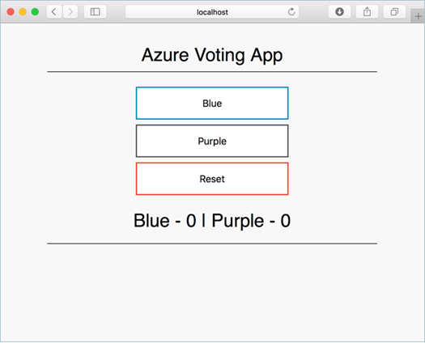

# Update an application in Azure Container Service (AKS)

After an application has been deployed in Kubernetes, it can be updated by specifying a new container image or image version. When doing so, the update is staged so that only a portion of the deployment is concurrently updated. This staged update enables the application to keep running during the update. It also provides a rollback mechanism if a deployment failure occurs. 

In this tutorial, part six of seven, the sample Azure Vote app is updated. Tasks that you complete include:

> [!div class="checklist"]
> * Updating the front-end application code
> * Creating an updated container image
> * Pushing the container image to Azure Container Registry
> * Deploying the updated container image

In subsequent tutorials, Operations Management Suite is configured to monitor the Kubernetes cluster.

## Before you begin

In previous tutorials, an application was packaged into a container image, the image uploaded to Azure Container Registry, and a Kubernetes cluster created. The application was then run on the Kubernetes cluster. 

An application repository was also cloned which includes the application source code, and a pre-created Docker Compose file used in this tutorial. Verify that you have created a clone of the repo, and that you have changed directories into the cloned directory. Inside is a directory named `azure-vote` and a file named `docker-compose.yml`.

If you haven't completed these steps, and want to follow along, return to [Tutorial 1 – Create container images](./tutorial-kubernetes-prepare-app.md). 

## Update application

For this tutorial, a change is made to the application, and the updated application deployed to the Kubernetes cluster. 

The application source code can be found inside of the `azure-vote` directory. Open the `config_file.cfg` file with any code or text editor. In this example `vi` is used.

```console
vi azure-vote/azure-vote/config_file.cfg
```

Change the values for `VOTE1VALUE` and `VOTE2VALUE`, and then save the file.

```console
# UI Configurations
TITLE = 'Azure Voting App'
VOTE1VALUE = 'Blue'
VOTE2VALUE = 'Purple'
SHOWHOST = 'false'
```

Save and close the file.

## Update container image

Use [docker-compose](https://docs.docker.com/compose/) to re-create the front-end image and run the updated application. The `--build` argument is used to instruct Docker Compose to re-create the application image.

```console
docker-compose up --build -d
```

## Test application locally

Browse to http://localhost:8080 to see the updated application.



## Tag and push images

Tag the `azure-vote-front` image with the loginServer of the container registry. 

Get the login server name with the [az acr list](/cli/azure/acr#list) command.

```azurecli
az acr list --resource-group myResourceGroup --query "[].{acrLoginServer:loginServer}" --output table
```

Use [docker tag](https://docs.docker.com/engine/reference/commandline/tag/) to tag the image. Replace `<acrLoginServer>` with your Azure Container Registry login server name or public registry hostname. Also notice that the image version is updated to `redis-v2`.

```console
docker tag azure-vote-front <acrLoginServer>/azure-vote-front:redis-v2
```

Use [docker push](https://docs.docker.com/engine/reference/commandline/push/) to upload the image to your registry. Replace `<acrLoginServer>` with your Azure Container Registry login server name.

```console
docker push <acrLoginServer>/azure-vote-front:redis-v2
```

## Deploy update application

To ensure maximum uptime, multiple instances of the application pod must be running. Verify this configuration with the [kubectl get pod](https://kubernetes.io/docs/user-guide/kubectl/v1.6/#get) command.

```console
kubectl get pod
```

Output:

```console
NAME                               READY     STATUS    RESTARTS   AGE
azure-vote-back-217588096-5w632    1/1       Running   0          10m
azure-vote-front-233282510-b5pkz   1/1       Running   0          10m
azure-vote-front-233282510-dhrtr   1/1       Running   0          10m
azure-vote-front-233282510-pqbfk   1/1       Running   0          10m
```

If you do not have multiple pods running the azure-vote-front image, scale the `azure-vote-front` deployment.


```azurecli
kubectl scale --replicas=3 deployment/azure-vote-front
```

To update the application, use the [kubectl set](https://kubernetes.io/docs/user-guide/kubectl/v1.6/#set) command. Update `<acrLoginServer>` with the login server or host name of your container registry.

```azurecli
kubectl set image deployment azure-vote-front azure-vote-front=<acrLoginServer>/azure-vote-front:redis-v2
```

To monitor the deployment, use the [kubectl get pod](https://kubernetes.io/docs/user-guide/kubectl/v1.6/#get) command. As the updated application is deployed, your pods are terminated and re-created with the new container image.

```azurecli
kubectl get pod
```

Output:

```console
NAME                               READY     STATUS    RESTARTS   AGE
azure-vote-back-2978095810-gq9g0   1/1       Running   0          5m
azure-vote-front-1297194256-tpjlg   1/1       Running   0         1m
azure-vote-front-1297194256-tptnx   1/1       Running   0         5m
azure-vote-front-1297194256-zktw9   1/1       Terminating   0         1m
```

## Test updated application

Get the external IP address of the `azure-vote-front` service.

```azurecli
kubectl get service azure-vote-front
```

Browse to the IP address to see the updated application.


## Next steps

In this tutorial, you updated an application and rolled out this update to a Kubernetes cluster. The following tasks were completed:

> [!div class="checklist"]
> * Updated the front-end application code
> * Created an updated container image
> * Pushed the container image to Azure Container Registry
> * Deployed the updated application

Advance to the next tutorial to learn about how to monitor Kubernetes with Operations Management Suite.

> [!div class="nextstepaction"]
> [Monitor Kubernetes with OMS](./tutorial-kubernetes-monitor.md)