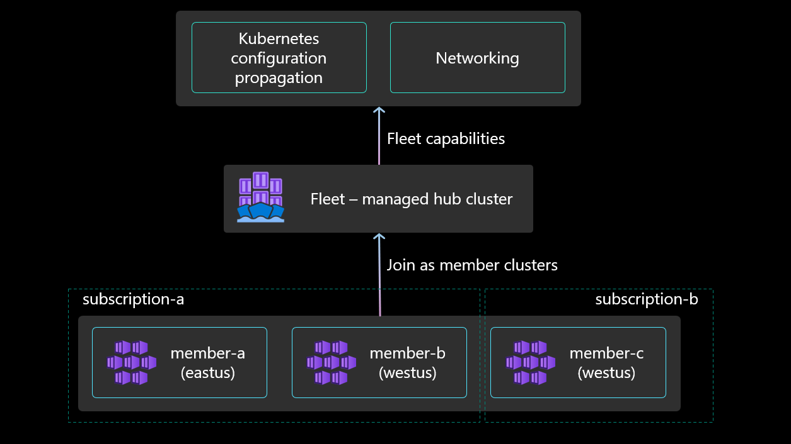
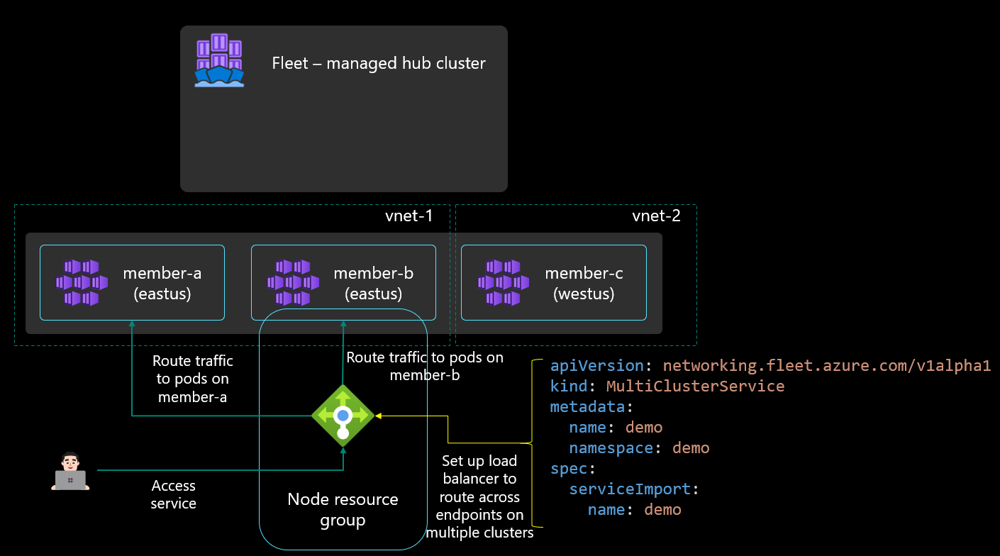

# Architectural overview of Azure Kubernetes Fleet Manager

Azure Kubernetes Fleet Manager is meant to solve at-scale and multi-cluster problems of Azure Kubernetes Service (AKS) clusters. This document provides an architectural overview of topological relationship between a Fleet resource and AKS clusters. This document also provides a conceptual overview of scenarios available on top of Fleet resource like Kubernetes resource propagation and multi-cluster Layer-4 load balancing.

[!INCLUDE [preview features note](./includes/preview/preview-callout.md)]

## Relationship between Fleet and Azure Kubernetes Service clusters

[  ](./media/conceptual-fleet-aks-relationship.png#lightbox)

Fleet supports joining the following types of existing AKS clusters as member clusters:

* AKS clusters across same or different resource groups within same subscription
* AKS clusters across different subscriptions of the same Azure AD tenant
* AKS clusters from different regions but within the same tenant

During preview, you can join up to 20 AKS clusters as member clusters to the same fleet resource.

Once a cluster is joined to a fleet resource, a MemeberCluster custom resource is created on the fleet.

The member clusters can be viewed by running the following command:

```bash
kubectl get crd memberclusters.fleet.azure.com -o yaml
```

The complete specification of the `MemberCluster` custom resource can be viewed by running the following command:

```bash
kubectl get crd memberclusters -o yaml
```

The following labels are added automatically to all member clusters, which can then be used for target cluster selection in resource propagation.

* `fleet.azure.com/location`
* `fleet.azure.com/resource-group`
* `fleet.azure.com/subscription-id`

## Kubernetes resource propagation

Fleet provides `ClusterResourcePlacement` as a mechanism to control how cluster-scoped Kubernetes resources are propagated to member clusters. 

[  ](./media/conceptual-resource-propagation.png#lightbox)

A `ClusterResourcePlacement` has two parts to it:

* **Resource selection**: The `ClusterResourcePlacement` custom resource is used to select which cluster-scoped Kubernetes resource objects need to be propagated from the fleet cluster and to select which member clusters to propagate these objects to. It supports the following forms of resource selection:
    * Select resources by specifying just the *<group, version, kind>*. This selection propagates all resources with matching *<group, version, kind>*.
    * Select resources by specifying the *<group, version, kind>* and name. This selection propagates only one resource that matches the *<group, version, kind>* and name.
    * Select resources by specifying the *<group, version, kind>* and a set of labels using `ClusterResourcePlacement` -> `LabelSelector`. This selection propagates all resources that match the *<group, version, kind>* and label specified.
    
    > [!NOTE]
    > `ClusterResourcePlacement` can be used to select and propagate namespaces, which are cluster-scoped resources. When a namespace is selected, all the namespace-scoped objects under this namespace are propagated to the selected member clusters along with this namespace. 

* **Target cluster selection**: The `ClusterResourcePlacement` custom resource can also be used to limit propagation of selected resources to a specific subset of member clusters. The following forms of target cluster selection are supported:

    * Select all the clusters by specifying empty policy under `ClusterResourcePlacement`
    * Select clusters by listing names of `MemberCluster` custom resources
    * Select clusters using cluster selectors to match labels present on `MemberCluster` custom resources

## Multi-cluster load balancing

Fleet can be used to set up layer 4 multi-cluster load balancing across workloads deployed across a fleet's member clusters.

[  ](./media/conceptual-load-balancing.png#lightbox)

For multi-cluster load balancing, Fleet requires target clusters to be using [Azure CNI networking](../aks/configure-azure-cni.md). Azure CNI networking enables pod IPs to be directly addressable on the Azure virtual network so that they can be routed to from the Azure Load Balancer.

The ServiceExport itself can be propagated from the fleet cluster to a member cluster using the Kubernetes resource propagation feature describe above, or it can be created directly on the member cluster. Once this ServiceExport resource is created, it results in a ServiceImport being created on the fleet cluster, and all other member clusters to build the awareness of the service

The user can then create a `MultiClusterService` custom resource to indicate that they want to set up Layer 4 multi-cluster load balancing. This `MultiClusterService` results in the member cluster mapped Azure Load Balancer being configured to load balance incoming traffic across endpoints of this service on multiple member clusters.

## Next steps

* Create an [Azure Kubernetes Fleet Manager resource and join member clusters](./quickstart-create-fleet-and-members.md)

